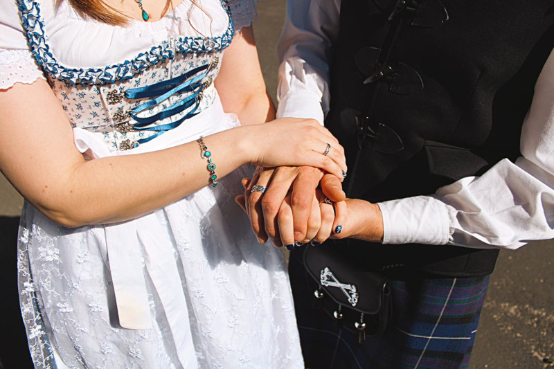
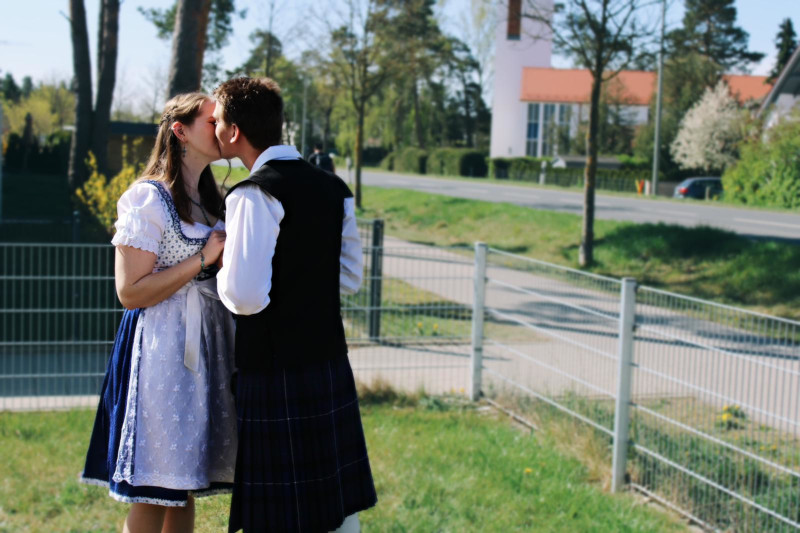
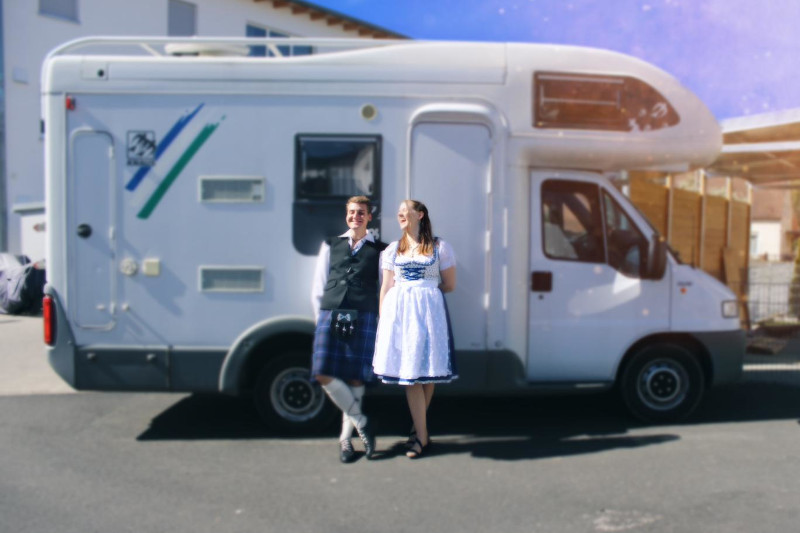
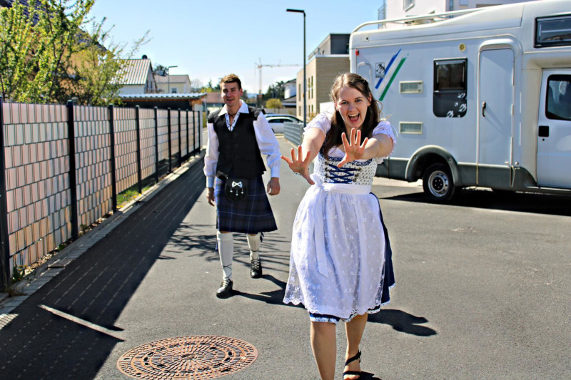

Lilo and Mike got married in April 2020. Their journey was delayed by Covid-19,
but now they have left everything behind to go on the journey of a lifetime with
nothing but their TARDIS (aka campervan), Atlas.

Lilo has trained as a nurse. Her hobbies include drawing, crafts, digital art and
writing stories - hopefully she'll find time for those in between adventures!

Mike is a stone mason and a fantastic cook. He loves being outdoors and is super
enthusiastic about anything to do with DIY, especially if it was also done by
Vikings.

As you may have guessed from the theme of the website, the two of them are also
huge geeks (Mike has an awesome collection of t-shirts!) and are following in the
footsteps of everyone's favourite time-lord to experience as much as they possibly
can of the world.

