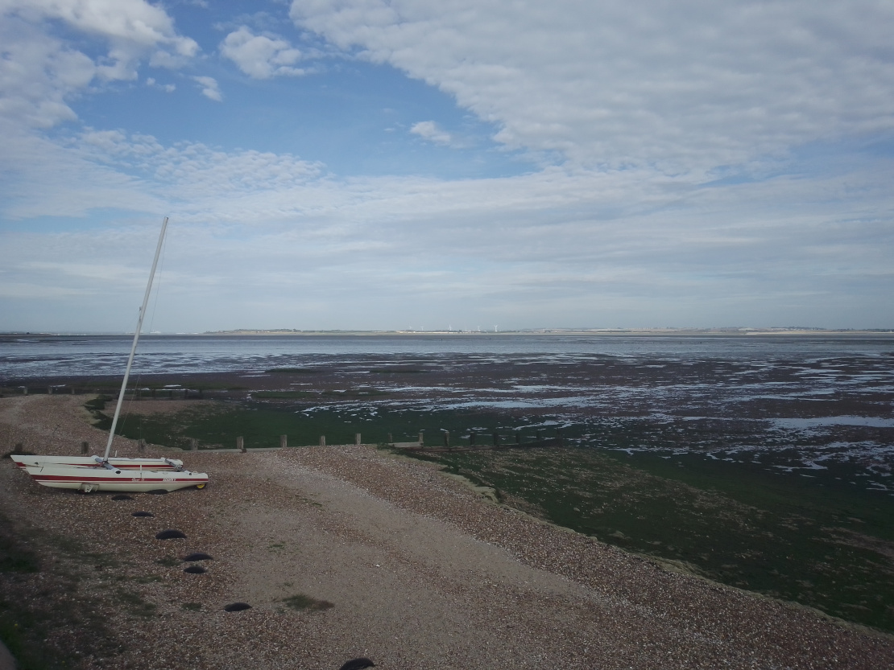
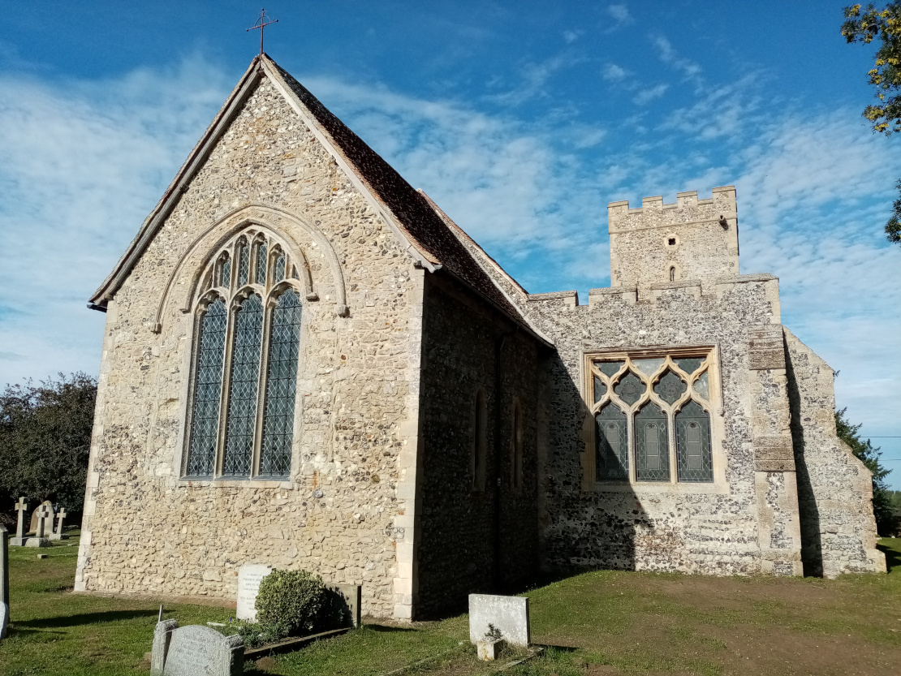
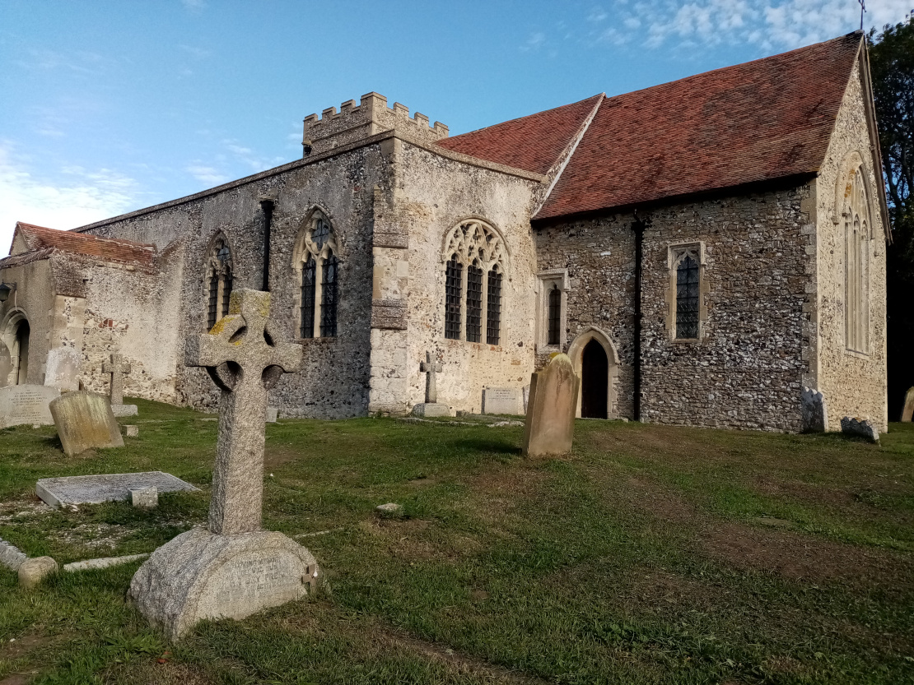
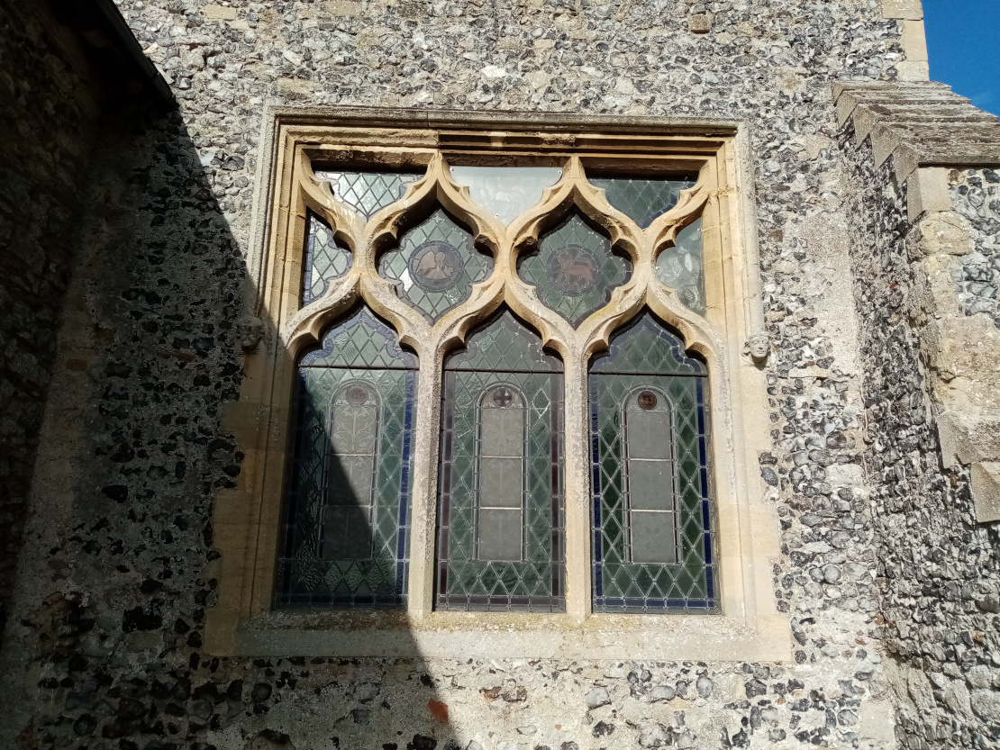
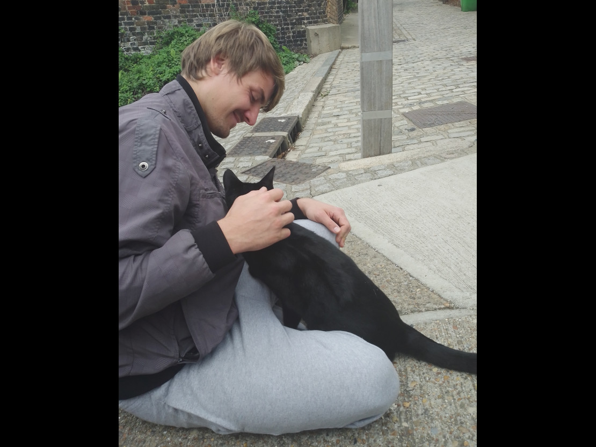
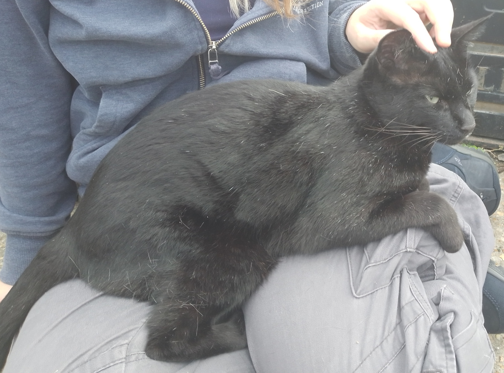
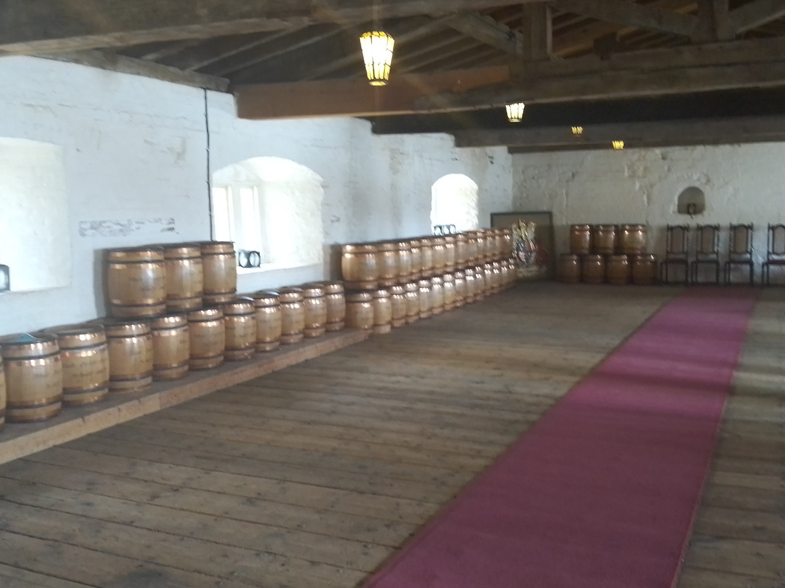
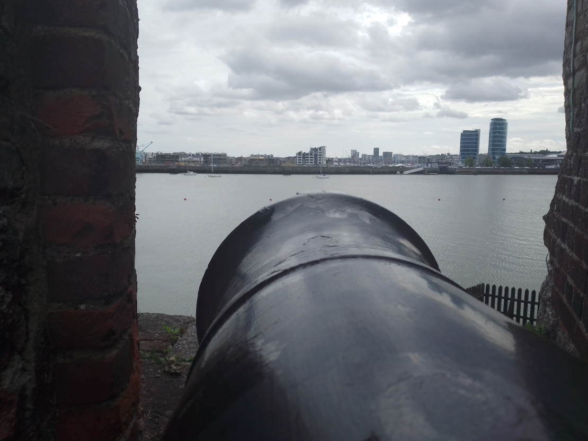
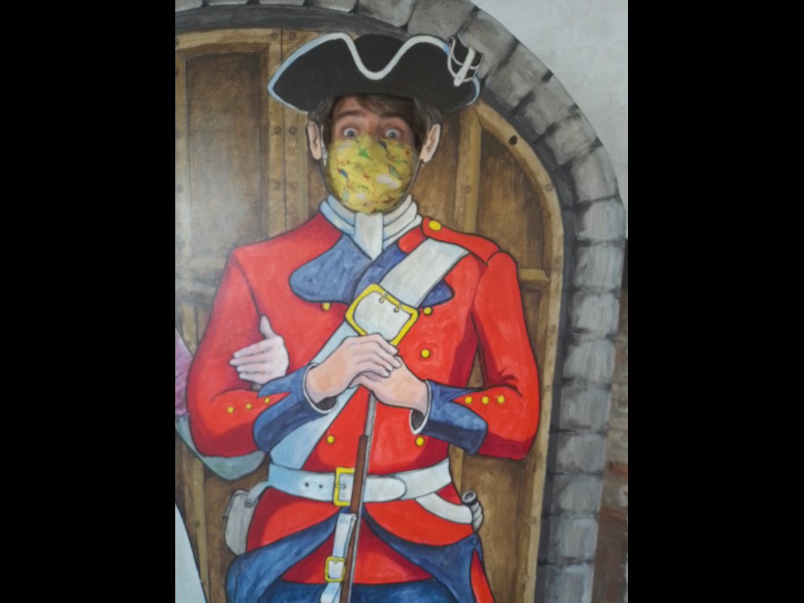

We made it!  
We had three days of preparation, hours of planning and discussions and one day of relaxing by the river before we drove to Calais.

There was a lot of different information flying around. Some websites said you can only cross the border to France if you have a negative Covid test that is less than 72 hours old, there was some hassle before we finally worked out if we had to self isolate in the UK, since we had to go through France (the answer being no, but only as long as we didn't stop in France and leave our car) and the Covid-form we had to fill out before entering the UK wanted addresses of our stay, which of course we don't really have.

At the end of it I'd had more contact with the English and French consulate than ever and we really just wanted to get going.

I was paranoid about getting over the German/French border and was even more worried about going over other borders. So we drove from Saarbrücken to Calais in one go, overnight. Normally that's a stretch that takes about five or six hours. Since we tried to avoid toll roads as much as possible while still staying in France and Atlas is a grumbly old campervan it took us nine hours. Nine hours of driving through tiny (and in the dark super creepy) towns of France. We did not really get to see very much. 

As we had planned for all eventualities any and all delays were not a problem. We made sure we had over fourteen hours between leaving Saarbrücken and arriving at the Terminal of the tunnel. 

As is often the case, I needn't have bothered worrying about any of it. There were no Covid related checks anywhere and contrary to the official UK government Website no one scanned our Covid form to make sure we had put in all the right details. The only checks we had at all were when we got to the Eurotunnel, where they took a peek at our passports. 

So now we are in England. The first really exciting thing we did was find a parking place (in this case a park and ride in Canterbury) and slept for what felt like twelve hours. When we got up in the morning, Mike announced that he wanted to visit a castle. Not a problem, since we're in England, the country which has castles aplenty. Or so I thought. 

It got a little more complicated when we discovered that almost all castles nearby were closed. The only one that was open was Upnor castle, so at least the destination choice was easy.

On the way there we stopped by a little church that Mike fancied (That was one of those rare fights I was not going to win). It was built sometime during the 12th century and has not changed ever since: Nice, small and cosy. Sadly the doors were locked, but Mike says the building itself and the ancient graves around it gave him an awesome feeling. 

And then we went straight to Upnor castle. My highlight was meeting a beautiful cat right before going in, who immediately decided that Mike and I were her new best friends. Within 60 seconds of meeting us she plonked herself on my lap and wanted our full love and attention for quite some time. 

The castle itself is small and practical, but nice. It's right above the dockyard of the river Medway and was initially built to protect the ships that were anchored there. That was in the mid-sixteenth century, while there was some tension between the UK and Spain (and probably everyone else).

It was used as an artillery fortification until 1667, which was when it saw its first and last action. The Dutch launched a naval raid, where they breached the defences, captured two war ships (one of them being the Flagship the 'Royal Charles') and burned down the dockyard before the English finally managed to make them retreat. According to one of the lovely ladies working at Upnor castle, we don't really talk about 1667, since it is considered the worst defeat of the Royal Navy and is just too embarrassing. 
Upnor Castle was considered too breachable after that and was turned into a storage place for ammunition, gunpowder and alike, while new forts were built further down the river. 

The story that we really liked was of the ship 'Loyal London'. A lot of ships were damaged during the attack and needed repairing, that one included. King Charles II decided that London should contribute to the repair of their own ships, since he paid to rebuild London after the bubonic plague. London however, was having none of it, so Charles ended up paying all the (very expensive) repairs himself. He was so disgusted by their behaviour that he renamed the 'Loyal London' into just 'London', once the salvaged timbers were used to rebuild her. He showed them, didn't he?

As for us, we're currently making our way north. Our plan (which seems to change daily and is starting to get difficult to keep track of) is to go up to Scotland and then come back down to England afterwards, so we will have plenty of time to see everything we want to. 

Here's to loads more castles.  
Adios 

