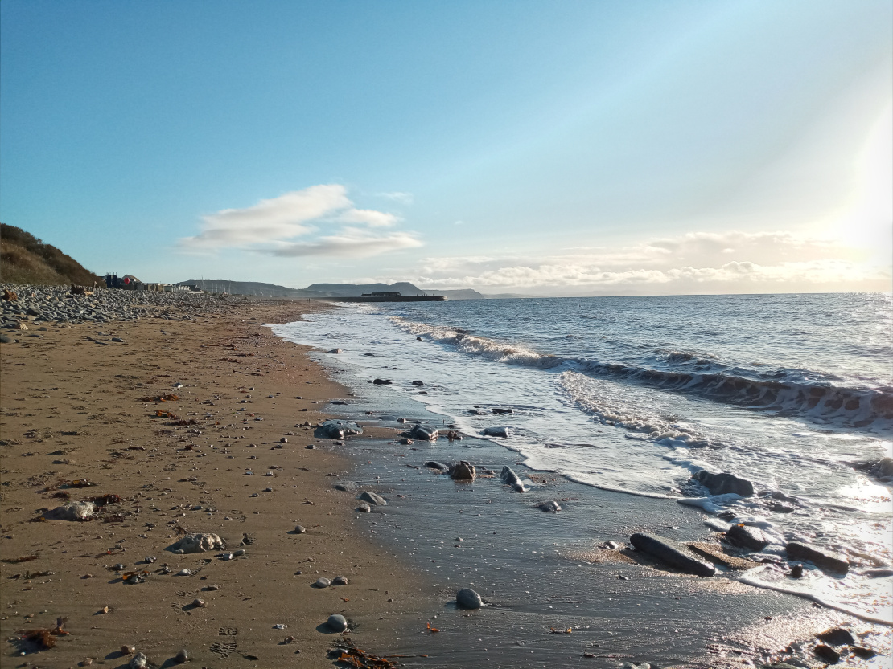
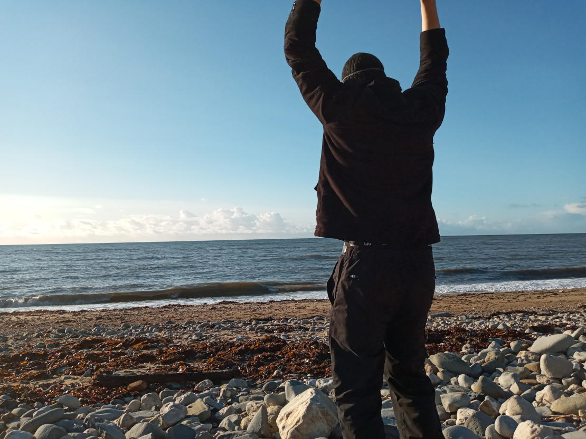
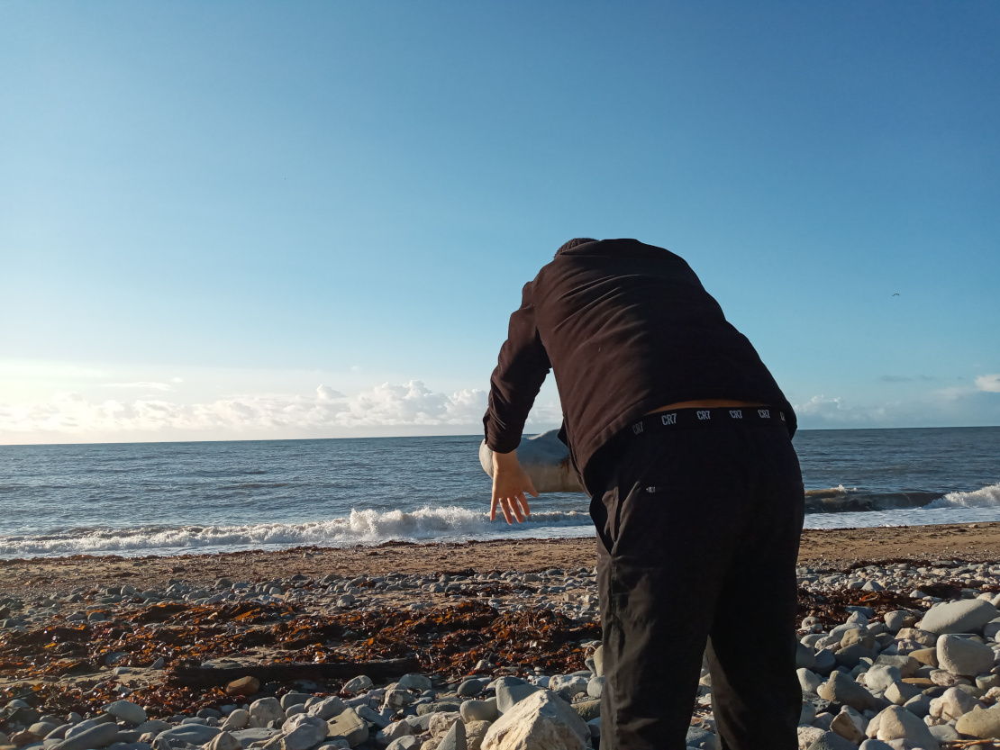
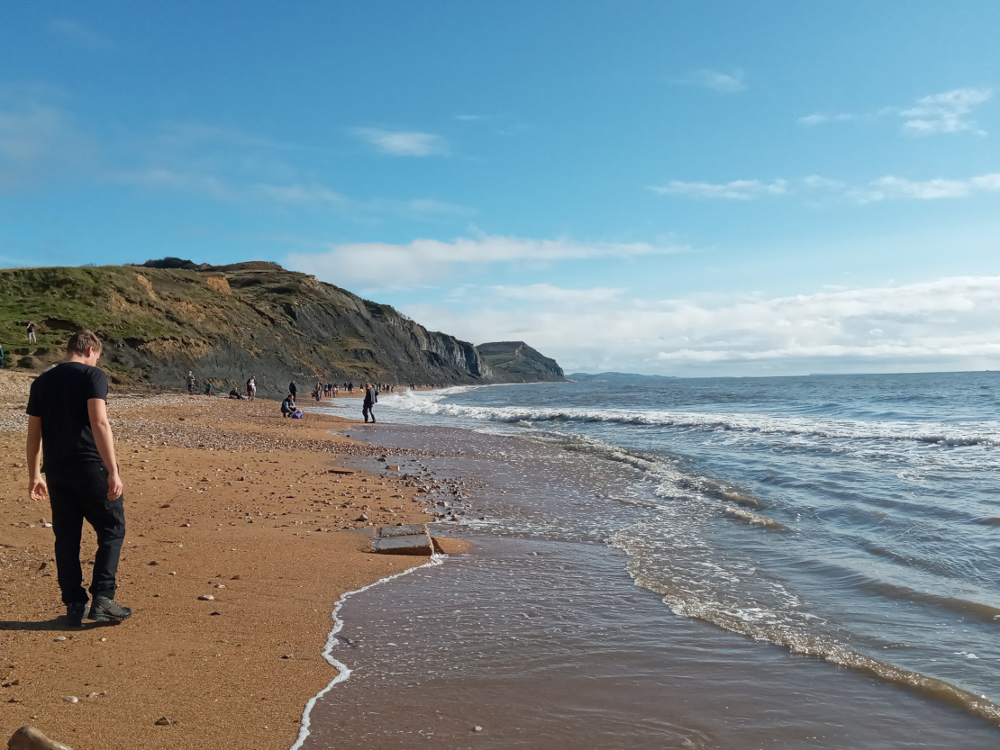
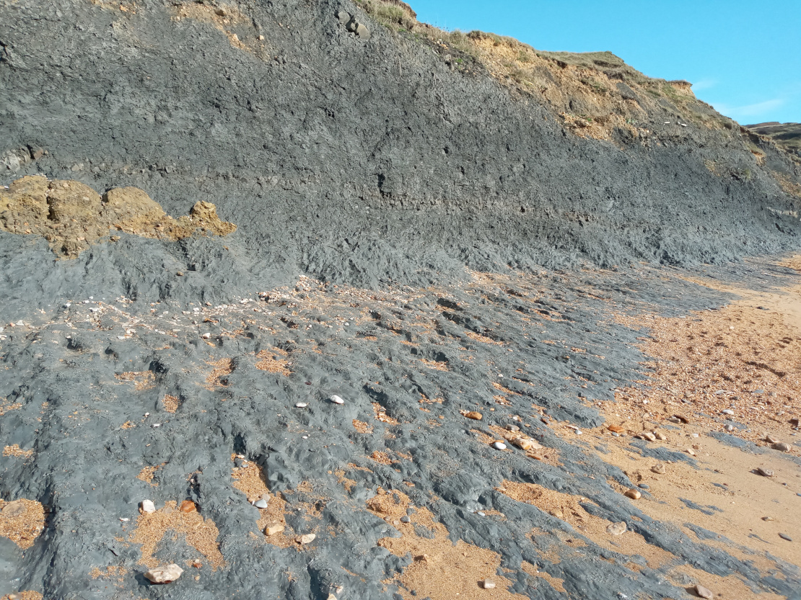
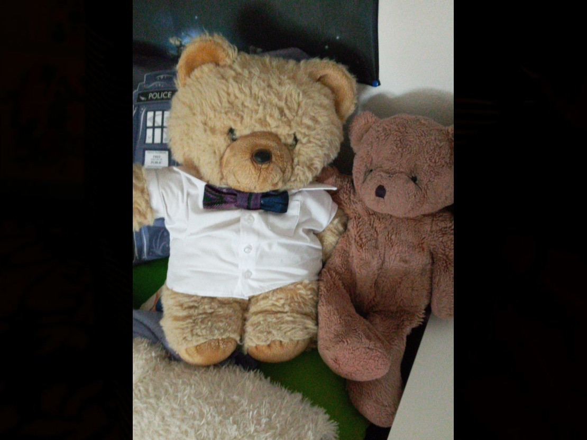
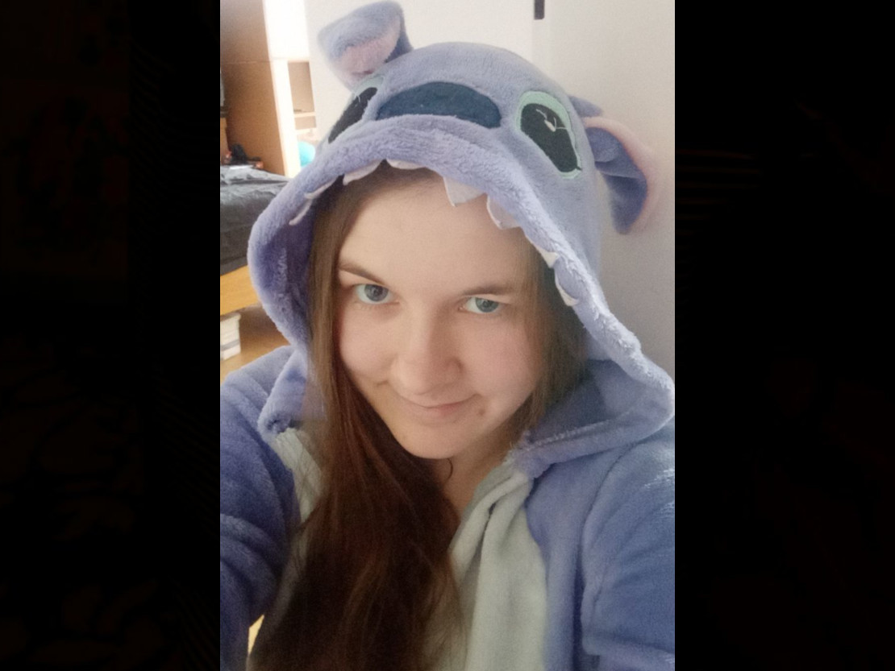
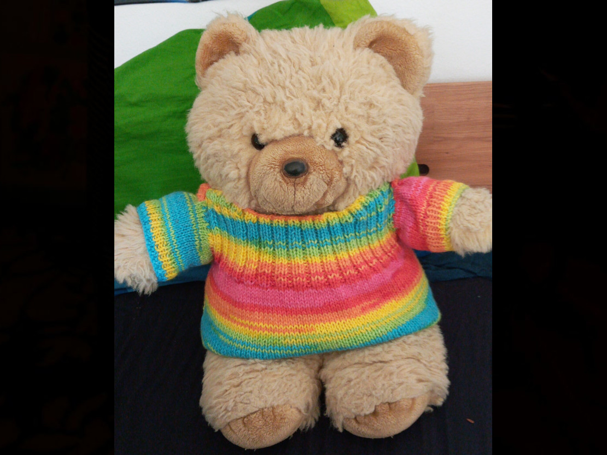

Mike and I don’t like Covid-19, as a rule. We have actually been really lucky on our trip so far and have had relatively few restrictions caused by the pandemic. 

Sure, we were hardly able to visit any church or building without booking in advance and yes, it was only possible to visit a fraction of the friends and family we wanted to for safety reasons. If I can’t hug my brother so much he swears off hugs forever in regular intervals there is just something missing. We also didn’t go to as many countries as we had planned to over the summer, because it was just too darn complicated and would almost always have involved two weeks of self-isolation in a hotel and/or a couple of hundred euros for each Covid-test. 

But all in all, we are still quite chuffed. We managed to get to the UK and we visited my mum for over three weeks, something that hasn’t happened in a number of years. We went to the highlands, to the sea, to various cities and sights that were on our bucket list, which is more than I had realistically thought we would manage when we left in August. We learned a lot more about Scottish and English history and I got to show off the beauty of my home country to Mike, to the extent that he has proclaimed Scotland more beautiful than Norway. That is something that we have debated about a lot since he went there over seven years ago and we could never really agree on. Not that it is a competition or anything, I just wanted to officially point out that we won. Muhaha.

Our Covid luck started to change when we decided we should head back to Germany. That was, by and large, due to Germany’s ‘red list’, a list of countries the government said had too many case numbers, so anyone travelling in from one of them would have to go into self-isolation. When we left for our NC500 trip the UK was not on it. When we got back to Linlithgow, Ireland and the London area were added. As we headed down to Salisbury, the Midlands were added, which is why we made sure not to stop anywhere there while passing through. And then, finally, on the day after we arrived in Salisbury, Scotland and most of England were added on. Not Salisbury and the southwest of England, but since it had only been a few days since leaving Scotland, we realised we would have to self-isolate. 

This presented a slight problem since we had given up our flat before leaving on our trip. We had spent a few weeks at Mike’s family home in the weeks leading up to the trip, but that was not suitable, since there was no area in the house we could isolate ourselves; and the rest of the family had a lot of contact with children. It looked like our only option would be to stay in the campervan, parked in front of their home. Which, I’m not going to lie, stressed us out just a tad. Sure, we would make the food and toilet situation work with help from Mike’s family, but as much as Mike and I love each other, two weeks of sitting in the campervan together, while not allowed to legally leave it, was going to be a test our marriage may not have been ready for. 

Which of course is when our last-minute rescue arrived in the form of my sister. I do love a good rescue. Liz pretty much lives with her boyfriend these days but keeps her flat because of the seven guinea pigs she owns. Basically, it’s their flat, she just regularly feeds them and does all the chores. Lazy pigs: they never help. So, since my dearest sister and the noisy bunch are very generous, she offered to let us stay there. In return for which we only had to do her chores and feed the pigs. It was a fair trade and Mike and I were especially happy since it meant we would have three times as much space as we were used to. 

The next Covid problem presented itself to us as I was trying to figure out how long we would have to self-isolate. After reading through four different websites I finally came to the conclusion that every town and county in Germany was pretty much just doing their own thing and each place could decide for themselves if they wanted us to stay in self-isolation for two whole weeks after arriving in Germany; or for two weeks starting from the date we left the critical area (in our case there would have been about one week left); or if a negative Covid test was all they needed. 

So I emailed the local council, since the Covid information site said to email them. Predictably, they told me they were not in charge and gave me another email address to contact, who then also said they weren’t in charge and gave me still further contact info. Luckily, I really, really love exchanging emails with helpful authority people, otherwise, I would have been a bit peeved off at this point (see my sarcastic face? It’s there, believe me). 

After two days of emailing back and forth with the council and the public health department, we finally received the confirmation that we had to self isolate after returning until we got a Covid test. If the test was negative, we could go about our lives; if it was positive we had to stay in the flat for two whole weeks. And we got an appointment for the test fairly quickly, too, so everything was set and my angsty nay-sayer, who always tells me what will go wrong (surprise: it’s everything!) was appeased. 

So Mike and I happily headed to the south of England to enjoy the last few days of freedom. We had the Jurassic Coast on our bucket list and since we didn’t actually check how long it was and what we actually wanted to see until a few days before heading down there, we just drove from one end to the other in a day. For those who don’t know, it is about 154 kilometres long.

We had the day split into sections. We started it in Exmouth before the sun came up and drove east to a wonderful sunrise. We arrived in Lyme Regis not long after the sun came up and spent four hours wandering around and doing something we had never done before: fossil hunting. There was only one slight problem we discovered as we started hunting, which was that we did not have the foggiest idea what we were doing. We only had the information that I had found online beforehand. We made sure to be at the right beach at the right time and had a lot of fun looking at funny rocks, Mike started throwing large rocks at larger rocks to break them open since the website had suggested that, but by noon we had walked up and down three beaches and didn’t have one fossil to show for it. 

So we did what we do best and gave up. No, kidding. We packed up everything, drove the few miles to Charmouth and continued our hunt there. Since we didn’t have an epiphany at any point and the tourist fossil hunt was closed, we again went away empty-handed. Well, we had no fossils. I did find a variety of large shells and stones that I packed; and Mike subsequently made me get rid of half of them since I may or may not have taken half the beach with me. I get a bit over-excited about shells sometimes. 

We had about another 15 stops that we wanted to make after that, but since we had dawdled (and happily so) at the beaches, we had to pick one last attraction on our way to Canterbury. We chose the Durdle Door, which turned out to be a bad idea. Not the door, per se, from what we could tell it’s lovely. The problem was, once we arrived there, there was only one parking place we could find where we could stop and the only option was to buy a day ticket for the parking place. Which cost over 20 pounds. 

Now, I may be overly stingy, but 20 pounds is 45.7 cans of Irn Bru in your average Tesco -that’s enough to get me through at least a fortnight or two! And I had read up on the Durdle door: it sounded like a wonderful natural phenomenon, but then again… Irn bru. So we did a sneaky and pretended to go and buy a parking ticket. Instead, we walked to the edge of the cliff to get a glimpse of the huge stone door. It looked pretty cool and we definitely want to get up close at some point, but I think we’ll make a day trip and hike there from somewhere less expensive. 

So we headed east for the rest of the evening until we finally arrived in Canterbury again. We had gone full circle and took a moment there and then to think about just how far we had travelled in just two and a half months. I’m not going to lie: it felt pretty great.

We had a day in Canterbury, which we had planned with sightseeing and a scary night boat trip, which was part of a pre-Halloween thing. We had been looking forward to it, but sadly it ended up not happening because of some technical issue. Instead, we had a lovely, if rather wet, day in the city, with one last portion of fish and chips and a glimpse at the Canterbury Cathedral. 

The next morning we got up early. Actually, since we had been getting up really early most days we ended up waking up almost two hours earlier than planned. We decided not to waste the extra time we had and to treat ourselves to breakfast before driving all day, so I picked out the only Restaurant open (a McDonald’s) on the way to the Eurostar terminal. We were really chuffed with ourselves since we sometimes lose track of time and end up having to hurry, but this was the day we were going to be super early and well-organized. 

Something in me found that whole situation suspicious, but I did not realize why until we were on the motorway: there was a loud bang and the campervan got rather difficult to control. Thankfully, some part of the emergency training from my driving lessons was still intact, so I somehow managed to get Atlas to the side of the road without any sudden braking or a crash. We then got out to look at the damage, even though we knew as soon as we heard the bang what it was: our right tyre had burst. 

As it was we were seriously lucky. I didn’t let myself realise until later just how serious an accident we could have had, but at that moment we were a little troubled. Mike and I can change a tyre as well as the next person (though admittedly, I would probably need to watch a youtube video to make sure I was doing everything right). The problem was that we were on a motorway. In Germany that would not have been a big problem, I had us at the edge of the motorway, where (in my mind) there should have been a hard shoulder. But the UK isn’t big on those, so changing a tyre on the right side of the car was beyond dangerous. And from our driving lesson days, we knew that driving with a burst tyre was a no-no, which meant we couldn’t simply get off the motorway. 

So we did the only thing we could do: Messaged my mum. Well. Mike stayed outside to make sure no one rammed into us (I’m a little unclear what his plan was, but I imagine he was going to use his superhuman strength to knock anyone off our lane), while I first messaged mum, who kept me calm enough so I could then call the German ADAC, who called the British AA; and lastly I called Eurostar to see if they could in any way help us out. 

We were quite lucky with the train, too, actually. Since we had no idea how long it would take until we got help, the lady from Eurostar pushed our reservation back by an hour and told me to call if we needed to move it again. Thanks to Covid (yeah, I just said that) she had space on every train for the whole day. By the time I had everything organised, the guy from AA called to find out where exactly we were.

He was really nice, too. He told us to drive to the next exit and fitted the tyre on in a matter of minutes. While he worked we chatted a bit (keeping our distance and with masks on, of course) and when I told him our destination and the situation we were in, he decided to follow us down to the coast to tighten the screws of the tyre before we made the trip to Germany. So we felt quite safe and happy when he left us at the entrance, especially since we still had almost twenty minutes before the check-in was due to close. 

It was only when Mike said ‘So this is the ferry entrance… Where is the Eurotunnel entrance?’ that I realised that in all the confusion, I had in fact taken us to Dover instead of Folkestone. Now, according to Google, driving from Dover to Folkestone takes about 16 minutes. Since it was foggy it took us a bit longer and usually there is heavy traffic in the area, which would have made us a lot slower. However, thanks again to Covid (yup, I just said that again), we met hardly anyone on the road and covered the stretch in 19 minutes, arriving less than half a minute before check-in closed. Could we have just called ahead and asked them to push us to the next train? Sure, but where’s the fun in that?

So, we made it. We had to go without breakfast and lunch, but we crossed the English Channel and drove until 2 in the morning, slept for a couple of hours and kept on driving until we got back to Regensburg, where we then spent a few days just…existing. 

We’re pretty much stuck here, for now. Thanks to all the restrictions, we can’t travel anywhere without a lot of hassle and we would feel bad potentially spreading the virus while the numbers were so high, anyway. We are using the break to work and save up some more money and hopefully we can soon continue our trip.

I’m sorry the last few posts have been so late.  I have been putting off finishing them, since I felt if I finished writing them, our trip would actually be over. But it’s only for now and we honestly had a blast. 

Thank you to everyone who has made our trip so far so absolutely amazing and a special thanks to Liz for setting up this super cool blog for us. We can’t say how much we appreciate that we have been able to have this wonderful time in our lives. 

We hope we have something to report again soon (if only a day trip or something) and hope you all stay healthy and as happy as possible in these difficult times. 

Lots of love,  
Lilo and Mike
