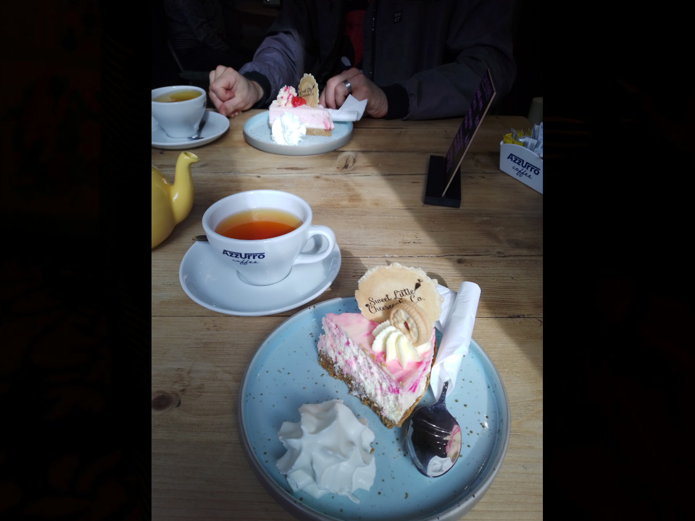

Linlithgow has turned into our base of operations to take over the world. That's a secret though, so keep it to yourselves. 

Our first step to taking over the world is to travel the world. If you have ever wondered where Pinky and the Brain, Dr Drakken and all the other mighty evils went wrong while trying to conquer the world - that’s where. You can’t conquer what you don’t understand. 

But why did we choose Linlithgow, you ask? Well, mostly because Linlithgow has St. Michael as its patron saint and the motto ‘St Michael is kinde to strangers’. Although Mike and I are not superstitious, we never look an omen-horse in the mouth. Also, my mum lives here, but that’s just a happy, very cuddly coincidence.  

To better understand the Area of West Lothian we have been taking day trips to nearby places. 

The first place we had to check out was, of course, Linlithgow itself. 

The most sightseeing worthy part of Linlithgow is right next to our new headquarters: the loch (called Linlithgow Loch) and the palace (guess what that’s called). 

The loch is very pretty and has lots of ducks, geese, swans and some adorable and tame cygnets. All the animals of the loch seem to live off the residents of Linlithgow. I assume they bribe the people with their cuteness, because no matter what time of the day you go past the loch, there is always at least one family feeding them a bag of toast. 

Mike has decided that this is the only reason people buy toast here, since (as far as he is concerned) the ‘bread’ is not actually edible. He seems a bit touchy about the fact that toast and different toast is the whole range of bread you can get in the supermarket. 

The palace is very lacking in cygnets but does have some interesting stories.  
Before the palace was built by King James I in the 15th century, there was a fortification built by English soldiers that occupied the lands called ‘the Peel’. Apparently in 1313, while King Robert the Bruce was busy recapturing Edinburgh, Dundee and Perth from the English, there was a Scotsman named William Bunnock who quite often sold hay to the garrison in Linlithgow. One day instead of delivering hay to the Peel, he parked his wagon in the gate, so that it couldn’t be closed and eight other Scots jumped out of his cart. The nine of them then captured the Peel for Scotland and Robert. It was later dismantled, to make sure the English couldn’t use it against them again. 

Later, in the 15th and 16th century, the palace that was built was used as a residence for monarchs. Most notably King James V and Mary Queen of Scots were born there. 

It is quite popular with the tourists these days, amongst other things because parts of Outlander were filmed in Linlithgow Palace. The filmmakers used it as Wentworth Prison, where poor Jamie had a rather tough time. I’ve heard fans of Outlaw King also like to visit since the Palace was used instead of Scone Palace for the crowning of Robert the Bruce. My mum actually sat by the loch as they filmed the scene with the boats emerging through the mist. 

Our next day trip was to Cockleroy and Torphichen. 
Cockleroy is a hill that overlooks Linlithgow, with the remains of a hillfort on the summit. It’s not very high, less than 300 metres, but if you happen to be very lucky and have a non-Scottish-weather day you can see as far as Arthur’s Seat, a hill by Edinburgh. 

Look at how lucky we were: 

You would think getting up and down that hill is very easy, especially since one whole side of it is nice and green and evenly paced so that people can wander around.  
And it really is. 

Unless you have an adventurous husband who likes to go off the beaten track. Then it can theoretically take a while and will sometimes end up in walks through boggy ground and thistles. 

I am rather glad the weather was as good as it was, otherwise I am sure we would have been misled by hinkypunks and would never have made it to the wee village of Torphichen. 

The village doesn’t have much in the way of tourist attractions. Asides from a couple of houses, there is a tiny inn named after the place and a preceptory. The preceptory was the headquarters of the Knights Hospitaller before it was turned into a parish kirk. 

We had a nice walk around Torphichen, though, before enjoying a meal in the Torphichen Inn. 

We had another day trip to Falkirk, where Mike was given a custom made sgian-dubh as a wedding present from mum. 

Mike was ecstatic about the knife and really, he still is. Every now and again he takes it out of its box and stares at it with a glint in his eye. I give him another month before he starts stroking it and calling it his precious. 

To be fair, the work is beautifully done, so thank you very much to mum for the present and Mads for this amazing work of art. 

If you now feel the very understandable urge to get a super awesome knife for yourself, you can check out Mads' site here: http://sindreknives.co.uk/

For our last day trip of the week, we got reinforcements. Sometimes you need an extra pair of eyes or two, to make sure you’re not missing any important details. For this task, we had Two-Thirds of the Troy Trio (also known as the 4Ts) brought in. 
Before starting our reconnaissance we had to get sustenance. For that, we went to the Sweet Little Cheesecake café. You will never guess what they sell. 

We all enjoyed our cake (in my case a Jammie Dodger Cheesecake) and some tea and then we were off, this time to the small village of Blackness. 

The village is set up by the Firth of Forth. After the Monarchs had built Linlithgow palace and started living there, this village was used as the port for Linlithgow.

We figured since it was so small it would be nice to go for lunch in the restaurant ‘the Lobster Pot’, before going for a walk along the beach to the castle of Blackness and further on. 

Unfortunately, so did everyone else in the council area of Falkirk, which meant that we then ended up going down the one-laned road of the village in our 5.5-metre-long campervan before getting stuck at the end of the road, with no parking space in sight. 

It took a while and a lot of help from the locals, but we did eventually find a parking space large enough for us and then enjoyed a nice meal in the restaurant. 

We then wandered along to the castle of Blackness. The castle has gone through a cycle of being used as a prison, an artillery fortification, a ruin and (after being repaired) as a prison and an ammunition depot again before finally becoming the tourist attraction and historic monument it now is. 

Thanks to Covid we couldn’t get in without a booking and most things are booked far in advance these days, so we had a peek at the dovecot before walking along the beach as far as we could. From there we also had a nice view of the Forth bridges! 

After regrouping we shared all the information we had gathered over a few rounds of the card game Wizard while enjoying the sunset by Linlithgow Loch. 

    

And that’s our story for today,
 
Lilo 
