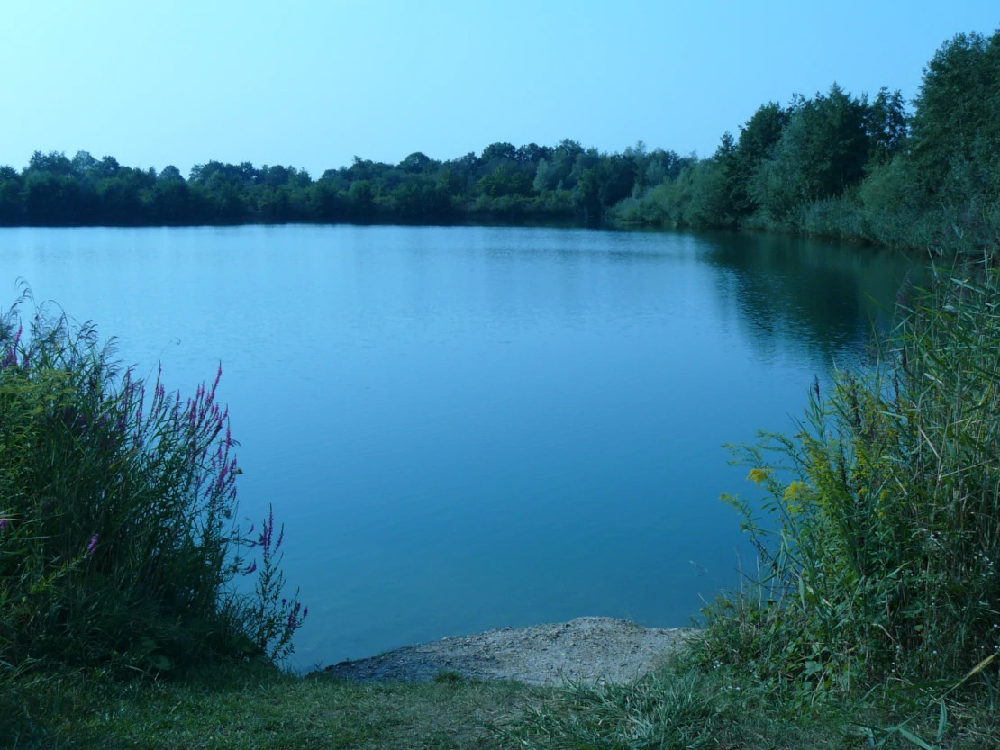

Ladies, Gents and people Non-gender,

after weeks of renovating, repairing, sewing and throwing out things just for the heck of it, we are now officially off!

Well…. When I say we‘re off, we left last night (at 5 minutes to Midnight, just because I like the name of the song) and managed - drumroll -  three kilometers! And what an adventure that was: Up steep hills and down scary valleys (well… one of each), right up to a thousand year old oak tree, where we set up camp for the night. And on the way there we stopped by a clothes deposit, which was very exciting.

I have to admit I had imagined our adventure to start off a little more… adventury. But we will get there.

We spent today visiting a couple of friends (at a distance, of course), to return some items that turned up while we were moving and that we may or may not have borrowed over 5 years ago (Oops, sorry guys). We have a few more items that belong to other people which we will return bit by bit as we travel through Germany. On our quest to find a camping place with a feeling of adventure for tonight, we ended up going to a lake near home (thanks for the tip, sis), where we went for a lovely swim to cool down from the blistering heat of the sun and enjoyed a nice view of the sun setting.

I had honestly expected to have more to tell about our first day of travelling, but there you have it. I imagine things will pick up a bit once we have left home territory.

Sending greetings from the lake,

Lilo and Mike

