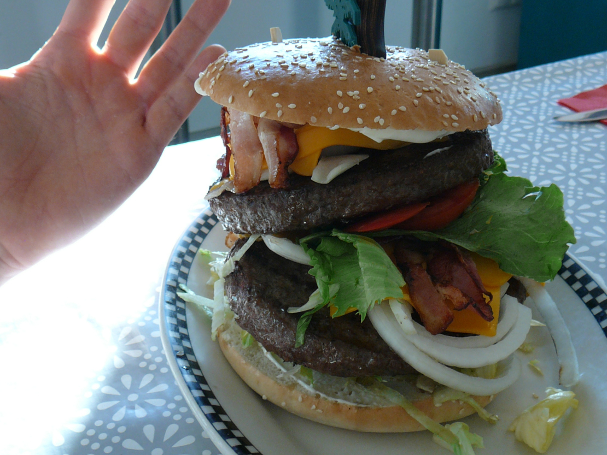
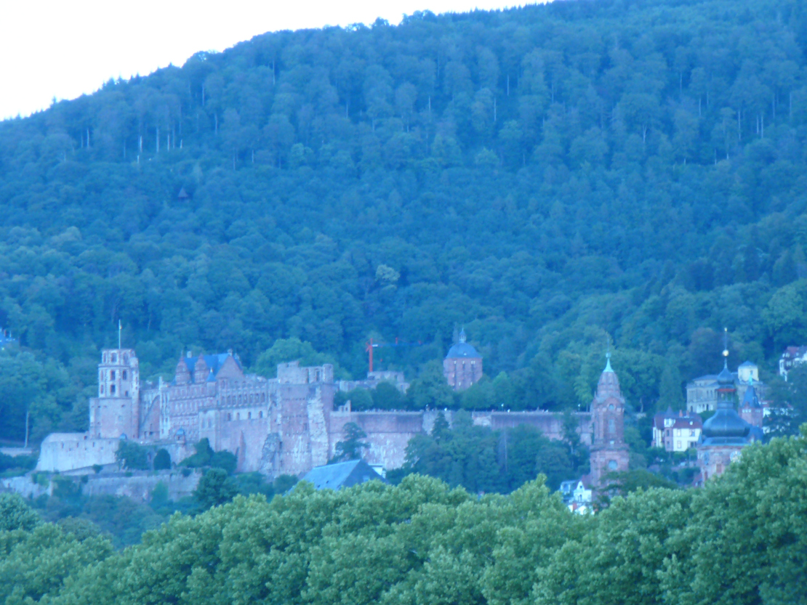
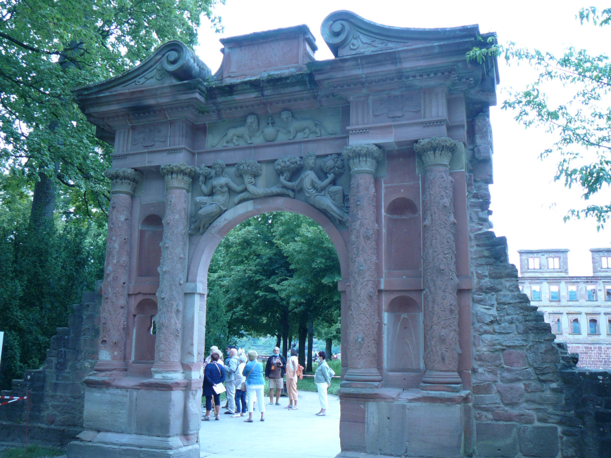
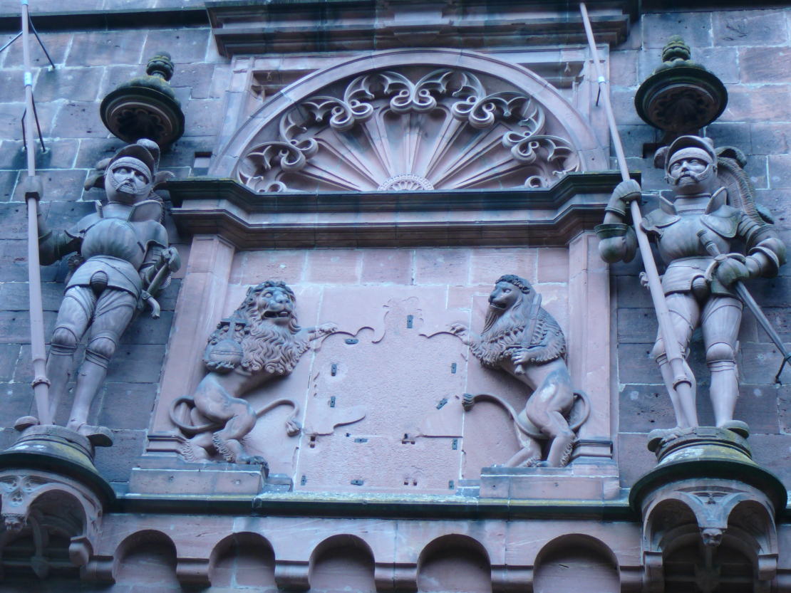
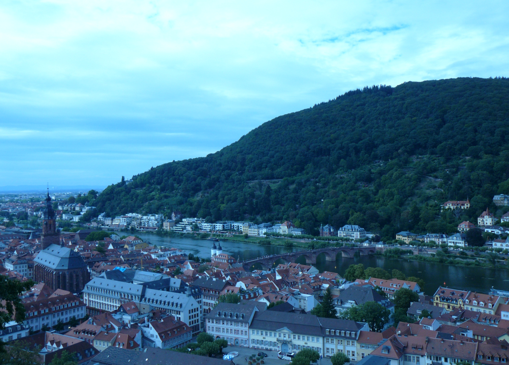
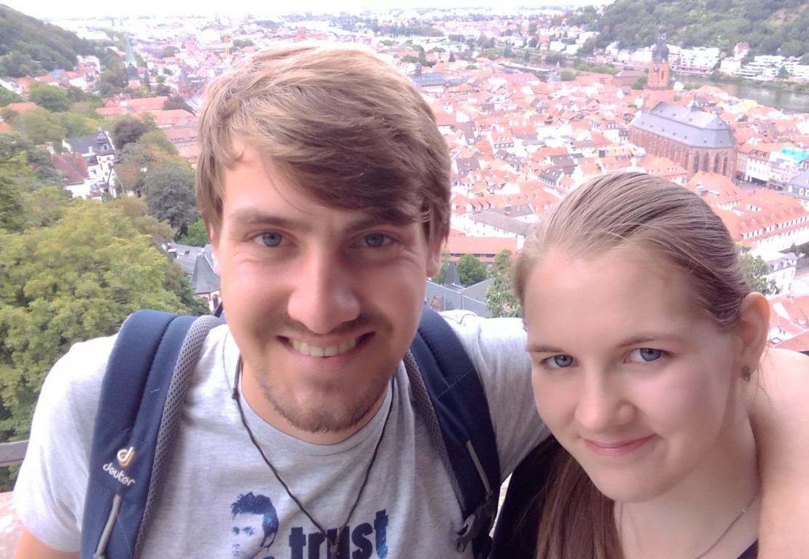
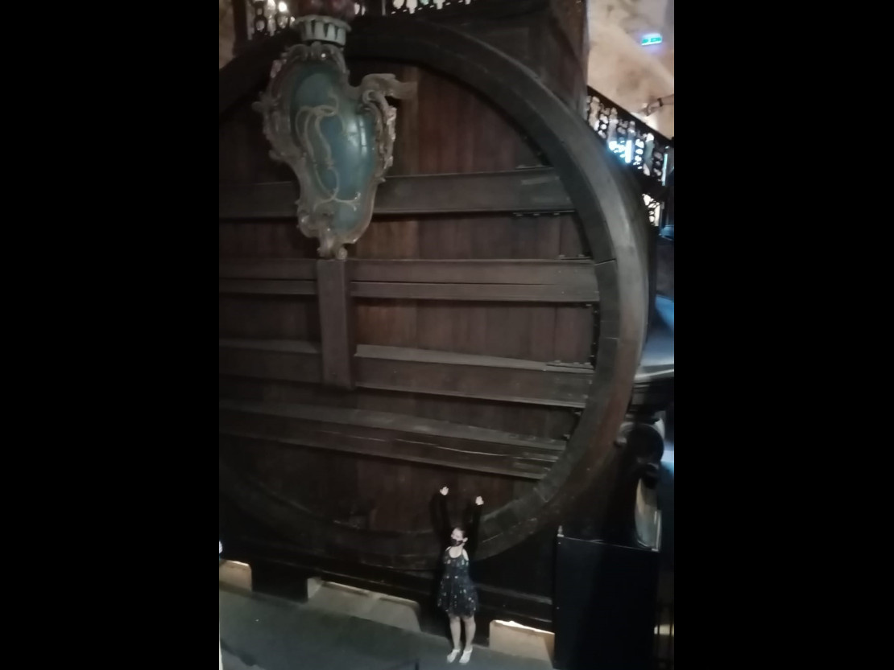

It’s been a while since we last posted anything. For the most part that is because we haven’t really been doing anything super exciting.

We visited Frankfurt for a day, where we got some super cool sleeping bags from my godfather (thank you, again!!!) and then spent a couple of days by another lake where we spent most of our time just swimming and relaxing.

And now we are in Heidelberg. It’s a lovely city in Baden-Württemberg with a lot of historic value. Mike discovered the best part of it within the first five minutes after arrival, which was when we were at a burger place and he ordered the largest burger I have ever seen. So many layers. So much meat. He almost finished it (So you can guess just HOW big it was), and the leftovers ended up as breakfast the next morning.

Apart from that we visited the Heidelberger Castle, which has some amazing stone sculptures in it, but we'll let the pictures speak for themselves.

We also saw and stood upon the worlds largest wine cask. This enormous container can hold up to 219.000 litres!

According to a friend of ours, there is a legend behind the cask. Apparently, at some point in the 18th century, there was a rather small and comparatively wide Court Jester named Perkeo, who was known for his love of wine. This love went so far, that he one day allegedly emptied the huge cask of wine in one gigantic gulp. What should have been a death sentence was no problem for the man. He did, however, one day die after accidentally drinking one cup of water. Poor guy.

All in all the castle is definitely worth a visit, especially if one is interested in European history and art, stonecrafted art in particular.

We had originally planned on staying in Germany for a little longer, but as it always is, plans change. We’ve decided to head up to the UK earlier, simply because we can and because we don’t know how the situation will develop. If things stay the way they are, we will start driving up as early as next week. The time until then will be used for preparations.

Here’s hoping it all works out.

Sending love,

Lilo & Mike

