So, da sind wir wieder! 

Nach unserem Besuch in Upnor Castle ging es Richtung Nottingham, durch den malerischen Sherwood Forest, Heimstätte von Robin Hood und seinen Getreuen. Eine Nacht zuvor nächtigten wir hoch oben auf dem Ivinghoe Beacon, 233 Meter über dem Meeresspiegel mit fantastischer Aussicht über die umliegenden Lowlands. Nach ein wenig Fresh-Air-Snapping und Bergwandern fanden wir uns in Nottingham wieder…

Oder besser gesagt darunter! Unter der Stadt nämlich, mit hartem Schweiß mit dem Zweispitz in den Sandstein getrieben, erstrecken sich meilenweite Tunnelsysteme. Diese eigene Welt wird ‘City of Caves’: ‘Stadt der Höhlen’ genannt und wurde bereits um 1200 n.Chr. von einfachen Bewohnern der Stadt darüber angelegt und, über die Jahrhunderte, immer wieder erweitert und vergrößert. 

Zunächst als einfache Möglichkeit genutzt Lebensmittel, vor Allem Wein und Bier, zu kühlen und sich zum gemeinsamen Zechen zu treffen, erhielten sie schon bald andere Zwecke. Zisternen wurden angelegt um den Bewohnern der schnell wachsenden Stadt ihre Ausscheidungen abzunehmen und sie in die Höhlen fließen zu lassen.  

Man stieß auf Wasserquellen und hieb Brunnen in den Fels um die Versorgung eines der wichtigsten Gewerbe im Mittelalter sicherzustellen, nämlich die der Gerberei. Dies ist die Handwerkskunst aus stinkenden, labbrigen Tierhäuten gutes, widerstandsfähiges Leder herzustellen. Der Prozess braucht bis zu 16 Monate und benötigt große Mengen an Wasser und Chemikalien, hauptsächlich Urin, in welches die Häute monatelang eingelegt werden. Der dabei entstehende Gestank in der Enge dort unten muss unerträglich gewesen sein, zumal Brunnen oft direkt neben einem der großen Fäkalienbecken gelegen war. 

Während des zweiten Weltkrieges wurden die Tunnel teilweise als Bombenschutzbunker während der deutschen Luftangriffe genutzt und erweitert. Der dabei abgeschlagene Sandstein wurde zerkleinert und in Sandsäcke gefüllt, die im Krieg nötig waren. 

Aber auch für dunklere Zwecke wurden die Tunnel genutzt, wie geheime Treffen von Verschwörern gegen die Herrschenden und im 19. Jahrhundert auch Arbeiter, die gegen Fabrikbesitzer und deren Ausbeutung dort unten einen Aufstand planten. Und mancher munkelt sogar Robin Hood und seine Gefährten hätten dort zwischen kaltem Stein und bei  Kerzenlicht den nächsten Streich gegen den Sheriff geplant….

    
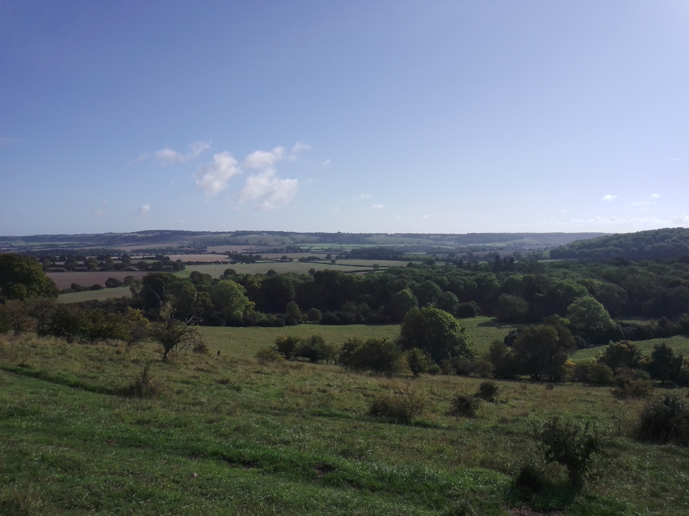

    

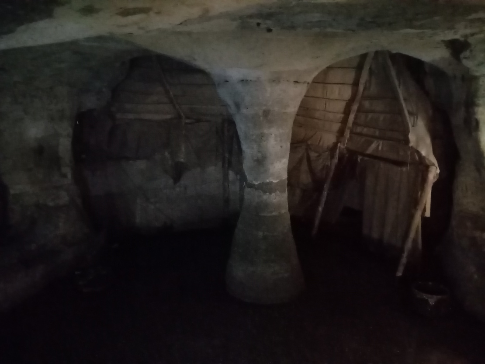

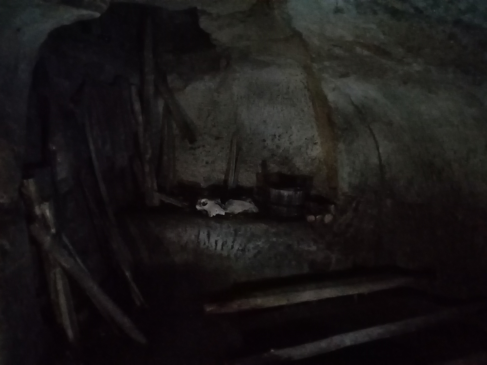

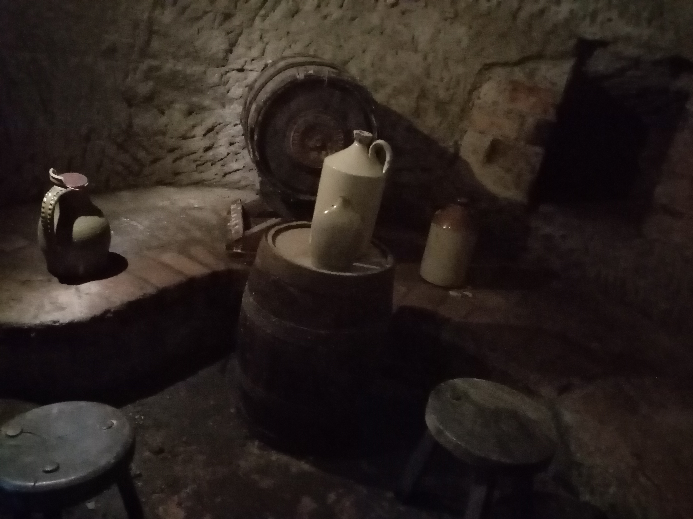

Danach fuhren wir durch den Sherwood Forest Richtung Lincoln um uns die ‘Lincoln Cathedral’ anzusehen, eine Kathedrale von immenser Größe.

Ursprünglich mit hölzernen Turmdachspitzen versehen, die heute leider nicht mehr vorhanden sind, hatte die Kathedrale eine stolze Höhe von 160 Metern und war damit, von ca 1300 bis ca 1500 n.Chr., das höchste Gebäude der Welt! 

Zwar damals im romanischen Stil errichtet ist sie heute auf den ersten Blick wegen der hohen Spitzbögen und riesigen Fensterelementen klar als gotisch zu erkennen. Dieses Meisterwerk mittelalterlicher Baukunst beinhaltet, wie viele Kathedralen, unterschiedliche Baustile, da es im Laufe der Zeit durch Brände beschädigt, fehlerhafte Berechnungen teilweise eingestürzt, oder in einem besonders traurigen Fall nach einem heftigen Erdbeben von oben bis unten gespalten, auseinandergebrochen war. Dadurch wurden bei jedem grundlegenden Neubau, bzw. Renovierung neue Bauelemente und Stile vom Festland mit eingearbeitet, aber teilweise auch komplett neu interpretiert und schlicht ausprobiert, beispielsweise wurden die in Frankreich neu erdachten Kreuzrippengewölbe hier verwendet, jedoch in erweiterter und einzigartiger Form. 

Einerseits erschuf einer der Baumeister das erste Stern- oder auch Fächer- oder Palmengewölbe, andererseits erblickte hier in Lincoln das “Crazy Vault” , das “verrückte Gewölbe” erstmals das Licht der Welt. (Allerdings ist mir Depp erst hinterher aufgefallen, dass ich von allem Fotos gemacht hab nur davon nicht :(  ...). Wer wirklich interessiert ist Fotos davon gibts auch im Internet :P 

Jedoch sind die Gewölbe lange nicht die einzigen Besonderheiten der Kirche. Sie zeichnet sich vor allem durch ungeheuer detailreich gearbeitete Ornamentik an beinahe jedem freien Platz, sowohl innen als auch außen, den Fußboden vielleicht ausgenommen. 

An mehreren Stellen sind Grabdenkmäler für ehemalige Bischöfe von Lincoln zu sehen, eines darunter derart schön und fantastisch gearbeitet, dass man auf die Knie fallen und weinen möchte. Zumindest ging es mir so angesichts solcher Schönheit. 

Die Kirche ist so reich verziert, wie man es kaum in einer anderen Kirche auf dem europäischen Festland findet, und wirkt doch gleichzeitig nicht überladen, ja regelrecht leicht und luftig, als würde sie nach dem Himmel greifen. Bisher das schönste Stück Architektur, das ich je gesehen habe. Aber wir sind ja noch ne Weile unterwegs :P

Allgemein ist ein Besuch in der Kathedrale absolut zu empfehlen, ein einzigartiger Ort unbeschreiblicher Schönheit und ehrfürchtiger Pracht.

Bis bald und bleibt alle gesund!

Euer Michi

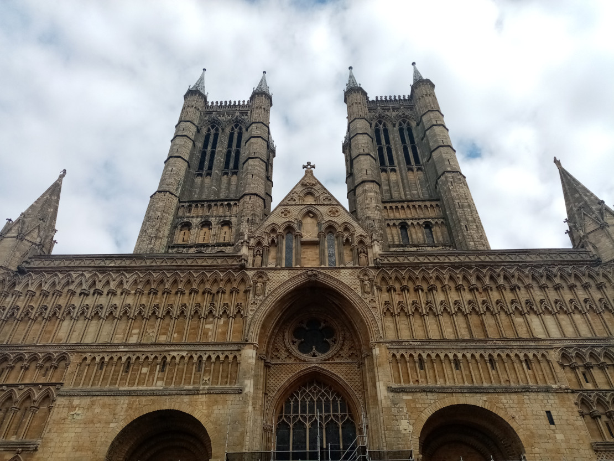

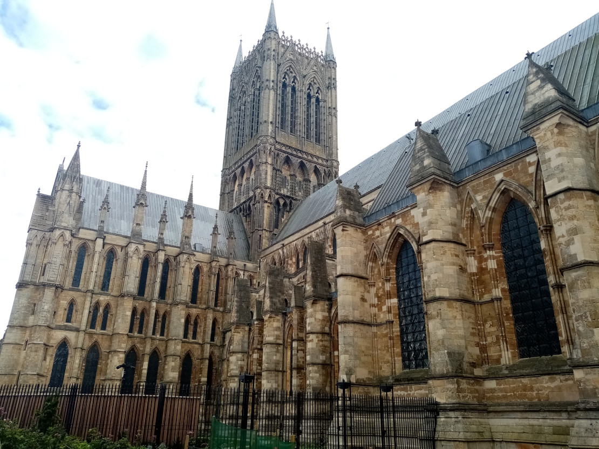

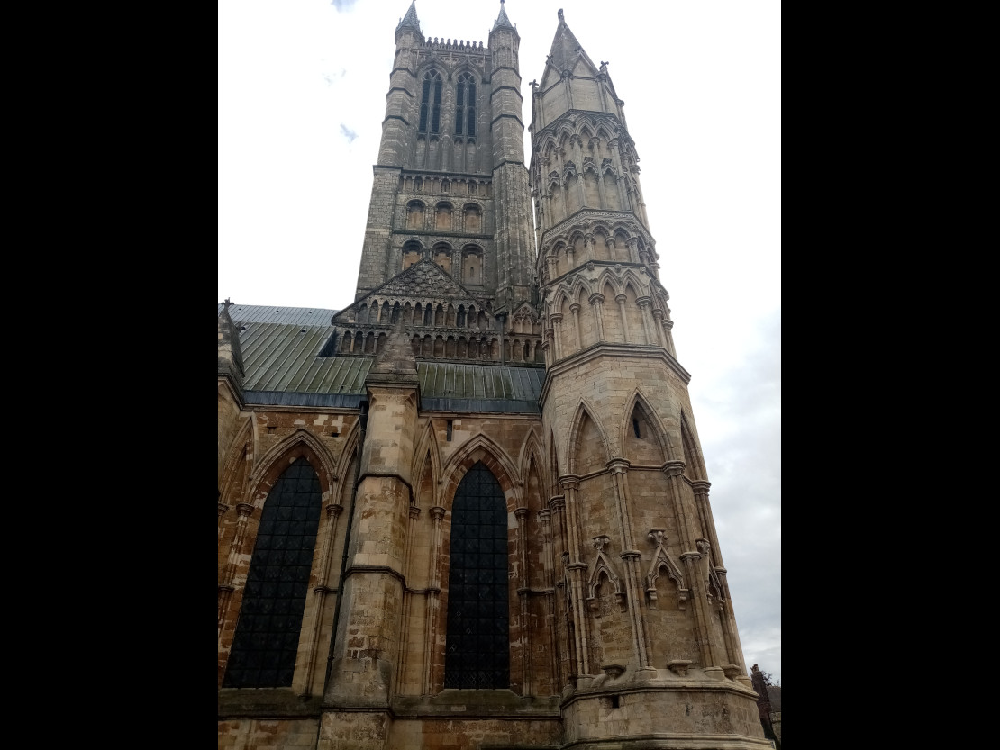

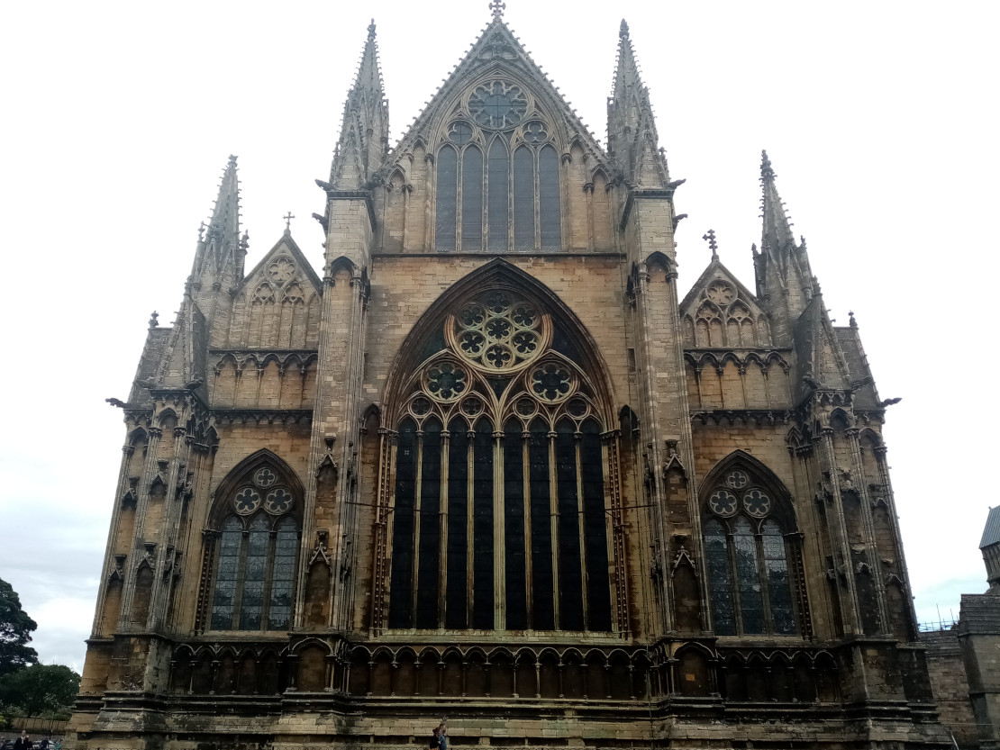

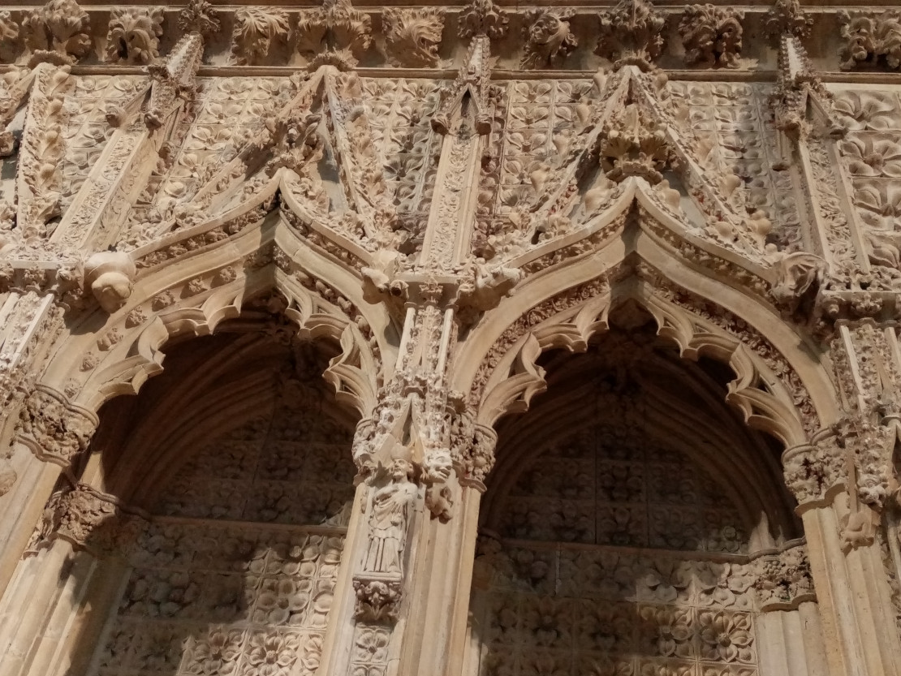

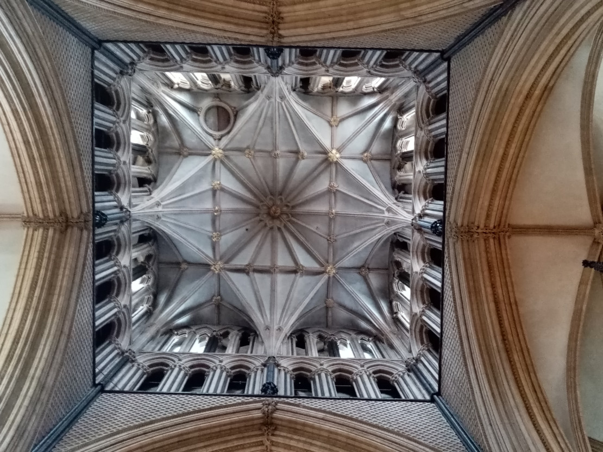

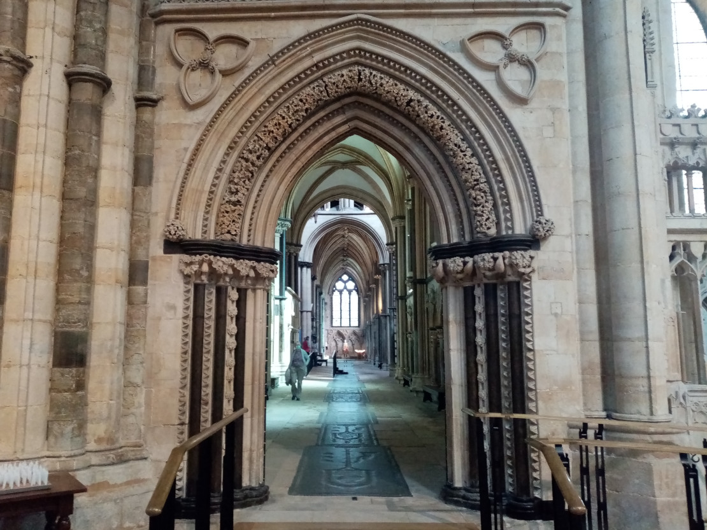

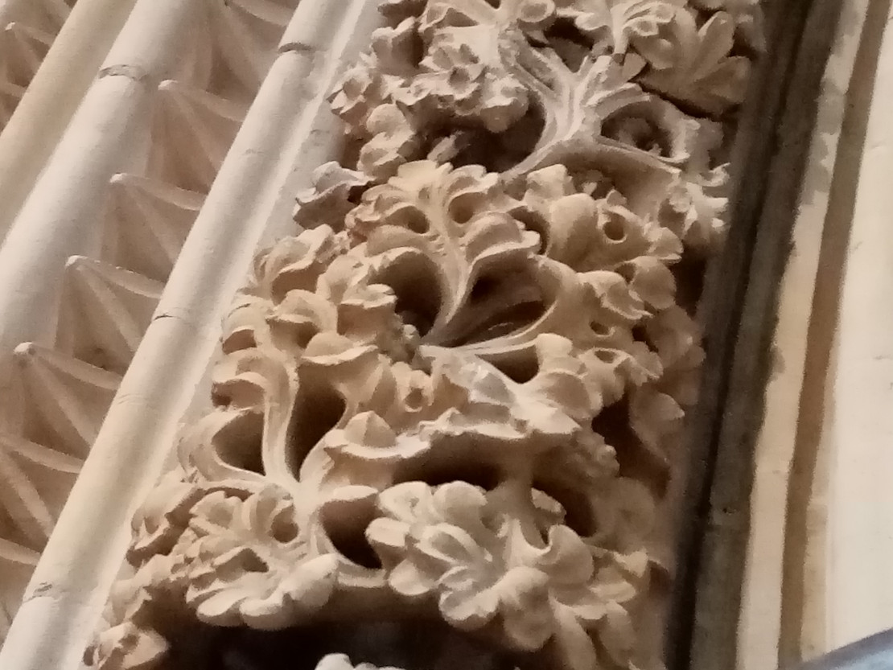

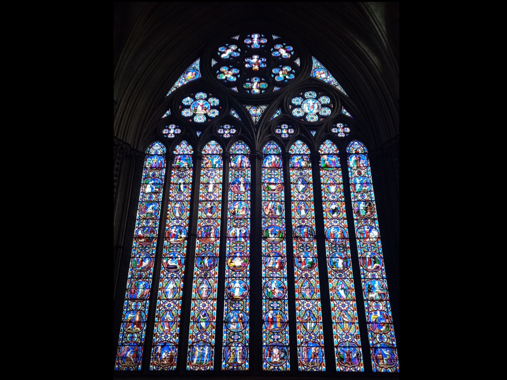

