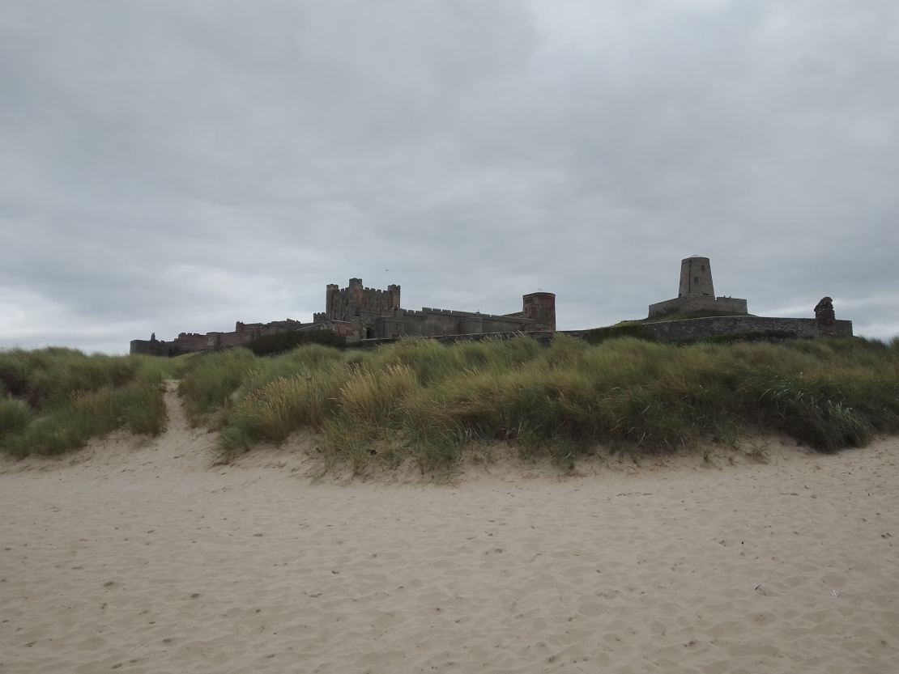
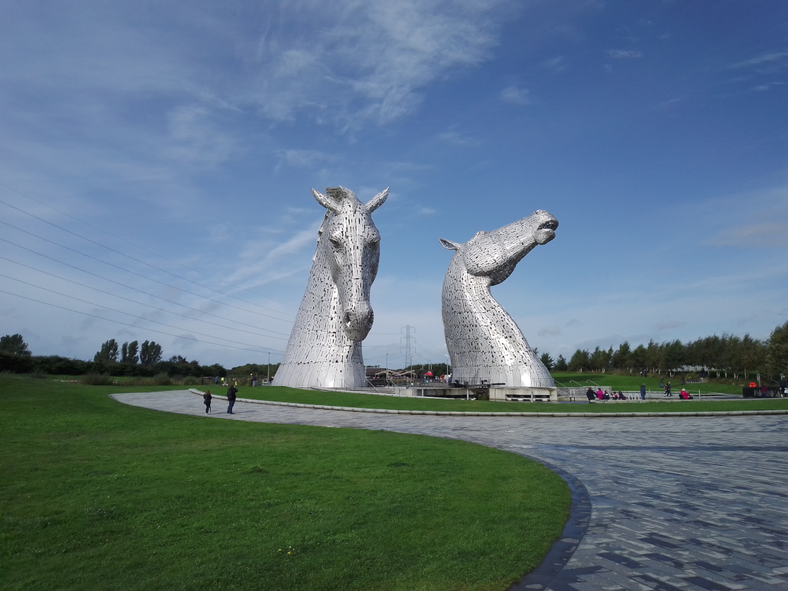
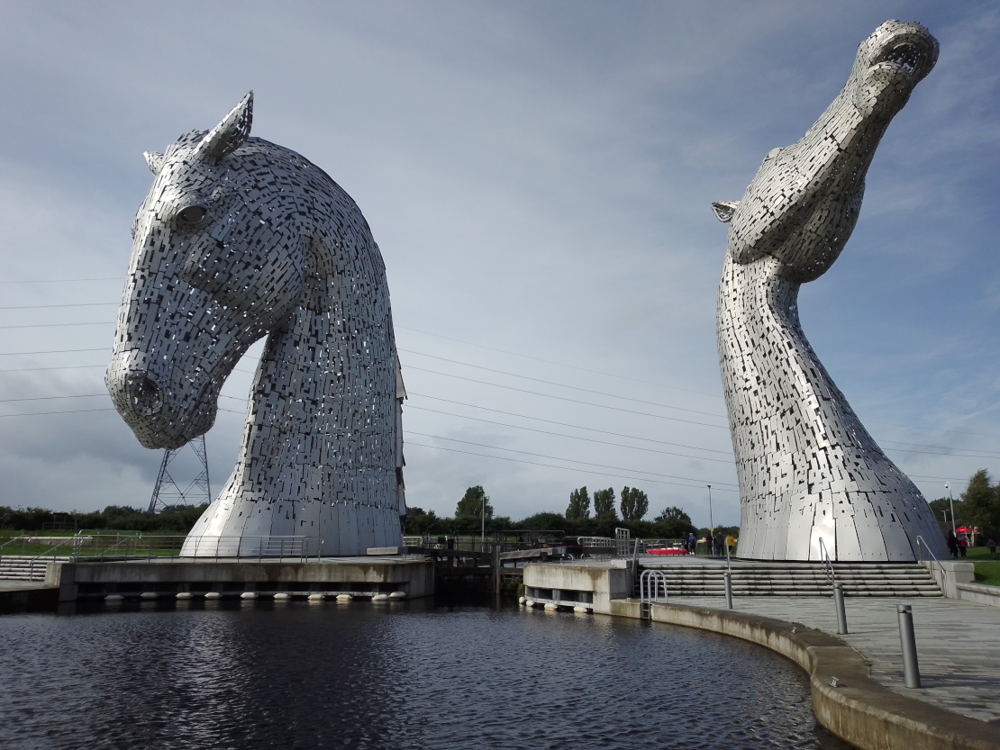
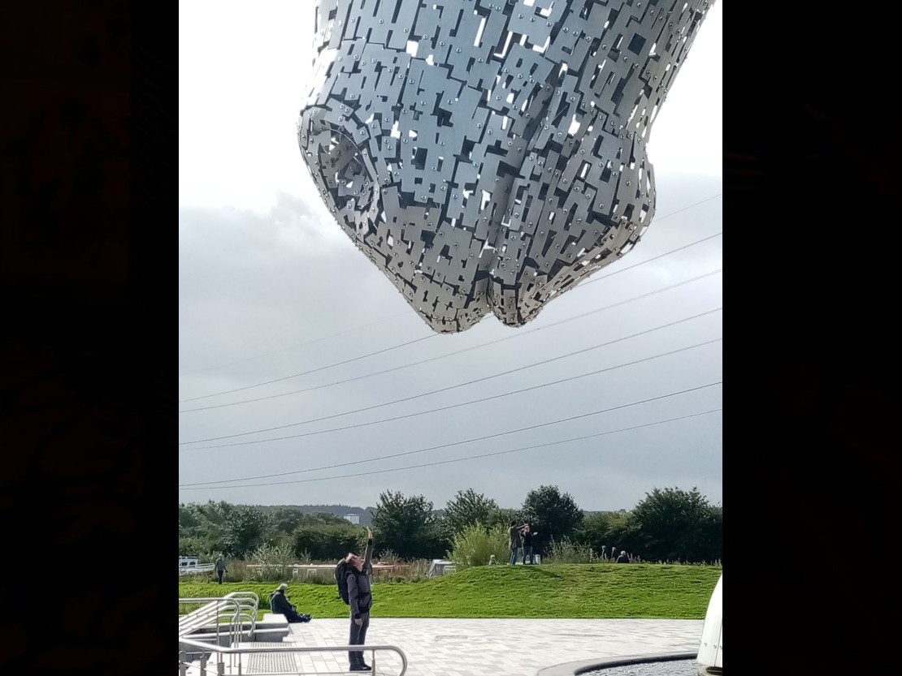
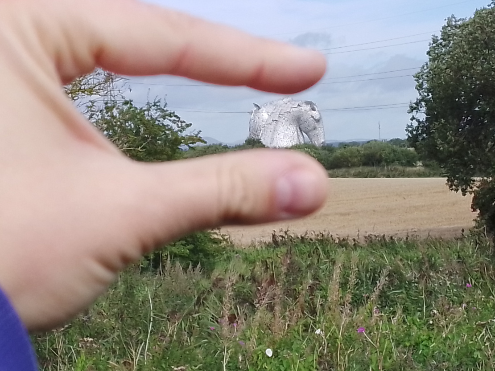
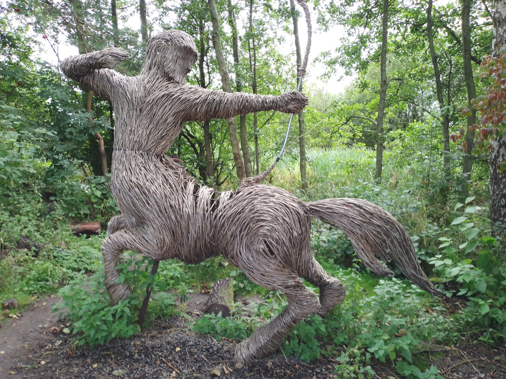

We were very sorry to say good-bye to Whitby, but at the same time very eager to continue with our Journey. So we packed everything up the next morning and headed north, keeping close to the coast the whole time. 

We passed Bamburgh (which you pronounce very differently from Hamburg, much to my confusion) and Mike loved the look of the castle so we stopped and went for a walk along the beach, to have a closer look. 

We are hoping to have a longer stop there some time, because it looks like the visit could be an adventure. 

The castle itself looks really cool at any rate. 

After our break we continued north until we came past a tiny brick wall, which was built through a large field, right up to the horizon. Next to the wall there was a sign saying ‘Welcome to the land of the Nac Mac Feegle’. 

Or something very similar, which made us think we may have possibly, actually, after weeks of anticipation, arrived in Scotland! 

We could have made a few stops on the way, but I was a bit impatient, so we hurried on until we got to the lovely little town of Linlithgow to have a longer stay and visit my mum. Amongst other things this visit means hugs, love and a real live shower, with instantly warm water. 

We’ve done a lot of relaxing in Linlithgow, but since we were close by, we also had a day trip to see the Kelpies by Falkirk. 

For those who don’t know, kelpies are mythical creatures that reside in the lochs and lonely rivers of Scotland. They are shapeshifters that usually appear as a horse to their victims, enticing them to ride on them. As soon as a human touches their mane, however, they find themselves unable to let go until the kelpie has taken them to their watery deaths. 

The lesson here is to not ride a random horse that has a dripping mane, the power and endurance of ten normal horses and is waiting ominously beside a deserted loch.  

The Kelpies of Falkirk are a bit less dangerous to humans though, unless you’re standing next to them while a giant pushes them over from the other side. I imagine that would be rather uncomfortable, as the steel statues are 30 metres high and each weigh about as much as two averaged sized blue whales.

They’re positioned in a park called the Helix, which was built to connect sixteen communities in the Falkirk Council Area and the Kelpies were built by an extension of the canal, which connects the River Carron and Clyde canal and then goes over to the Forth.

We had a really nice walk through the Helix and along the canal. 

While we were walking we also stumbled across a small patch of forest, which had a pathway called ‘the Wee Woodland Walk’ and on that path, to our surprise, there was a wicker centaur. He was ready for battle, so we didn’t stay long. 

Also it started raining, but that had nothing to do with our early retreat, honest. 

Anyway, that’s all from us. 

Lilo and Mike

